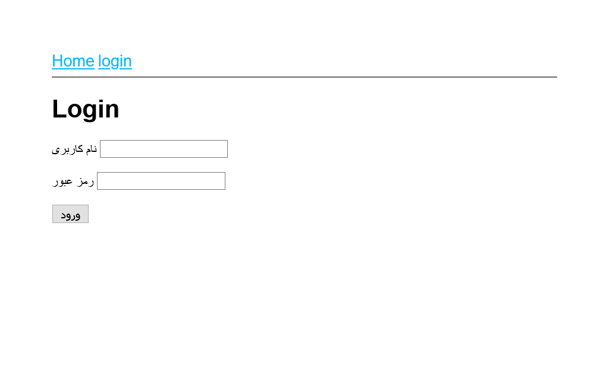

# express-generator



## powershell (not gitBash): 

```
yarn global add express-generator

// cd Desktop
express --view=ejs myappName

// cd myappName
yarn install 
yarn start
```

## Run

```
yarn start
```